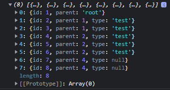
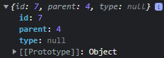
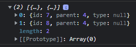
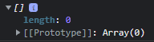
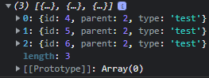
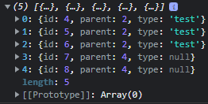
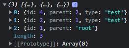

# MStroy test

## Результаты работы программы
getAll(); 

 getItem(7); 

 getChildren(4); 

 getChildren(5); 

 getChildren(2); 

 getAllChildren(2); 

 getAllParents(7); 

## Результаты теста 
### (3 ошибки в начале предусмотрены классом - три раза в тесте создавался экземпляр с невалидными входными данными)
 
E:\Progs\Nodejs\npm.cmd test

> mstroy@1.0.0 test
> jest

console.error
Sat Nov 19 2022 04:14:48 GMT+0300 (Москва, стандартное время) | TreeStore | Неверные входные данные
 TypeError: Cannot read properties of undefined (reading 'forEach')

      33 |             this.assocItems = {};
      34 |             this.assocChildren = {};
    > 35 |             console.error(new Date() + " | TreeStore | Неверные входные данные\n" + e);
         |                     ^
      36 |         }
      37 |     }
      38 |

      at new error (TreeStore.js:35:21)
      at Object.<anonymous> (tests/getAll.test.js:19:26)

console.error                                                                                                                                                                                                                      
Sat Nov 19 2022 04:14:48 GMT+0300 (Москва, стандартное время) | TreeStore | Неверные входные данные                                                                                                                              
TypeError: items.forEach is not a function

      33 |             this.assocItems = {};
      34 |             this.assocChildren = {};
    > 35 |             console.error(new Date() + " | TreeStore | Неверные входные данные\n" + e);
         |                     ^
      36 |         }
      37 |     }
      38 |

      at new error (TreeStore.js:35:21)
      at Object.<anonymous> (tests/getAll.test.js:20:31)

console.error                                                                                                                                                                                                                      
Sat Nov 19 2022 04:14:48 GMT+0300 (Москва, стандартное время) | TreeStore | Неверные входные данные

      11 |             // Если передан массив, но внутри не объекты - вывод ошибки, возраст обнуленного объекта
      12 |             if (items && Array.isArray(items) && items.length > 0 && typeof items[0] !== "object") {
    > 13 |                 console.error(new Date() + " | TreeStore | Неверные входные данные\n");
         |                         ^
      14 |                 return;
      15 |             }
      16 |

      at new error (TreeStore.js:13:25)
      at Object.<anonymous> (tests/getAll.test.js:21:26)

PASS  tests/getAll.test.js
TreeStore  
√ TreeStore invalid input for constructor (28 ms)                                                                                                                                                                                
√ return value from getAll() (1 ms)                                                                                                                                                                                              
√ return value from getItem() (1 ms)                                                                                                                                                                                             
√ return value from getChildren()                                                                                                                                                                                                
√ return value from getAllChildren()                                                                                                                                                                                             
√ return value from getAllParents()

Test Suites: 1 passed, 1 total                                                                                                                                                                                                       
Tests:       6 passed, 6 total                                                                                                                                                                                                       
Snapshots:   0 total
Time:        0.407 s, estimated 1 s
Ran all test suites.

Process finished with exit code 0